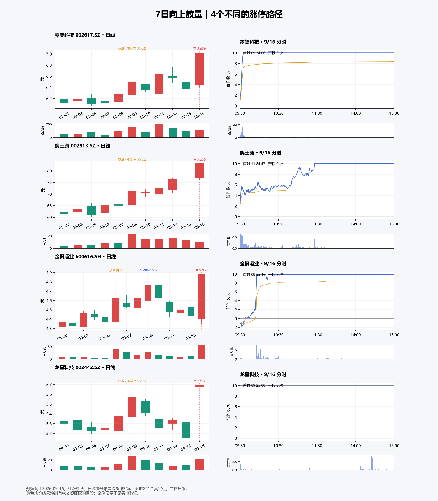

# 7日向上放量：成功样本的日线与分时走势

数据截止2026-09-16收盘。分析上一轮9/9—9/16各日候选中，随后收盘涨停的46只不同股票。每只股票按本观察段首次入选以及之后首次涨停计一次。目的为描述成功案例形态，没有拟合、修改或发布选股规则。

**较常见的路径是：放量阳线引起关注，随后出现缩量或回撤，最终在上午拉升封板。** 成功案例也包括跌破信号日低点后突然一字涨停等例外，不能归纳成唯一标准形态。

## 覆盖与口径

| 证据 | 覆盖 | 用途与限制 |
|---|---:|---|
| 已保存的日线价格、成交量和策略信号 | 46/46 | 用于放量日、整理阶段、涨停前一天和涨停当天分析；每只至少核验涨停前10个交易日 |
| 首封时间、开板次数、板型记录 | 46/46 | 日期逐只匹配；属于涨停事件记录，不等于完整分时曲线 |
| 首次涨停日的完整分钟价格与成交量曲线 | 17/46 | 全部为9/16，241点/只；不能代表其余29只股票的历史分时 |
| 首次分钟收盘涨停前，完整的累计均价证据 | 12/17 | 2只没有封板前可观察区间；3只在封板前已有均价缺失，不进入该项统计 |

“放量信号日”取本段首次入选档案中最后一个合格放量日，不是股票一生首次放量，也不是自动等于入选日。缩量指某日成交量小于这个信号日；上涨指收盘高于昨收；阳线指收盘高于开盘。均线仅使用当时及之前真实收盘价。

## 日线：六个观察

1. **信号日多为阳线，但不要求收在最高位。** 44/46（95.7%）为阳线；35/46收在全天振幅上半区，只有11/46收在上方20%区间。信号日涨幅中位数3.70%。不能把“几乎光头大阳线”当成这些案例的共同必要条件。

2. **常见放量幅度是2—3倍。** 本段首次入选时最后一次合格信号的成交量倍数中位数2.43；其中32只在2—3倍、13只在3—5倍、1只达到5倍。这里统计的是最后一次信号，不是窗口内最大倍数；原策略本身就要求至少2倍，因此“放量”不是新发现的区分因素。

3. **等待阶段经常反复。** 38只在信号日与涨停日之间至少有一个交易日；其中33只至少一天缩量，34只至少一天下跌，32只出现过缩量下跌。相对于信号日收盘，期间最低收盘变动中位数为−2.58%。这是阶段内最弱收盘相对信号收盘的变化，不是交易账户最大回撤。

4. **信号日低点有参考价值，但并非都守住。** 上述38只中，26只在整理期每天收盘都不低于信号日最低价；12只曾收盘跌破。只有15只全程守住信号K线实体中点。不能把“全程守住实体一半”直接升级为硬条件。

5. **涨停前一天未必强。** 只有19/46在前一天收涨；26/46站在5日均线上，26/46站在10日均线上。前一天成交量相对此前5日均量的倍数中位数1.04，达到2倍的12只。涨停前5日累计涨幅中位数仅1.30%。这批股票中相当一部分是整理或回落后的突然启动。

6. **突破常在涨停当天完成。** 37/46涨停收盘突破此前10个交易日最高价。涨停当天成交量相对此前5日均量的倍数中位数1.86，仅20/46达到2倍。该突破结果是事后特征，不能回填成前一天已经知道的信号。

## 分时与封板记录

### 全部46只：封板时间和开盘形态

| 首次封板时间 | 股票数 | 比例 |
|---|---:|---:|
| 10:00以前（含集合竞价） | 20 | 43.5% |
| 10:00—11:30 | 19 | 41.3% |
| 午后 | 7 | 15.2% |

合计39/46（84.8%）上午首次封板。这里是首次封板时间；如果之后打开，不表示该时间起一直封死。

| 涨停当天开盘相对昨收 | 股票数 |
|---|---:|
| 低开，低于−0.1% | 19 |
| 基本平开，±0.1%以内 | 8 |
| 高开0.1%—3% | 13 |
| 高开3%—7% | 2 |
| 高开7%以上 | 4 |

开盘涨幅中位数为0%。有42只换手板、2只一字板、2只T字板。23只记录为零次开板，其余23只存在开板记录，均最终收盘涨停。因此，单次开板本身不足以否定当天结果。

### 9/16的17只：完整分钟曲线

- 首次分钟收盘达到涨停前，最低成交价相对开盘价的跌幅中位数约0.50%；6/17曾比开盘价低至少1%。这是到第一次分钟收盘涨停之前的回落，不含此后炸板波动。
- 在封板前均价证据完整、且存在封板前区间的12只里，9只至少80%的分钟收盘价位于累计成交均价之上；该比例中位数88.8%。均价缺失的区间没有补值。
- 开盘至10:00的成交量占全天比例中位数48.96%，说明这17个样本的成交较集中于早盘。不过早封板本身也会压低后续成交，这不是独立的预测因子。
- 17只的分钟收盘、全日高低价均与日线核对一致；分钟成交量合计/日线成交量在0.999996—1.000003之间。

## 四个代表案例

| 股票 | 日线过程 | 首次涨停日分时 | 含义 |
|---|---|---|---|
| 露笑科技 002617 | 9/9上涨3.67%、放量2.40倍；其后反复，9/15下跌2.89%；9/16涨停 | 高开0.94%，09:34:06首封，零开板 | 整理后快速拉升；前一天收跌并未阻止启动 |
| 奥士康 002913 | 9/9放量3.46倍；之后缩量上行，中间有小回落；9/16涨停 | 高开2.12%，上午有反复，11:25:57首封 | 趋势延续型，封板可以发生在上午后段 |
| 金枫酒业 600616 | 9/4放量5.57倍，9/9入选；随后回落；9/16涨停 | 低开0.90%，最低约较昨收−2.03%，09:55:46首封，开板3次 | 低开回落后转强；多次开板最终仍可封住 |
| 龙星科技 002442 | 9/9放量3.48倍；期间最低收盘较信号收盘−7.36%，曾跌破信号日低点 | 9/16集合竞价直接一字涨停 | 属于例外路径，日线未给出统一的“强势整理”形态；涨停命中不等于可按开盘价成交 |

## 对“规律”的解释边界

最值得保留的观察框架是“放量信号 → 整理期间的量价变化 → 涨停当天的盘中确认”。成功样本里频繁出现缩量反复，上午转强封板较多。分析仅描述成功样本，没有与未涨停股票比较，因而不能证明这些特征提高命中率，也没有估算买入收益、手续费或可成交性。

从本观察段首次入选到涨停，与从实际放量日到涨停是不同计时：46只从上述放量信号日到涨停的间隔中位数为5个交易日，范围1—11日。比如恒兴新材9/9入选引用的信号是9/1；9/16涨停距入选5个交易日，距信号11个交易日。7日滚动窗口会使同一个旧信号持续出现在后续候选中。

如果以后优化逻辑，建议先把信号距今天数、整理幅度、缩量情况、盘中均价相对位置作为观察字段；本次不据成功案例直接提高量倍门槛、增加均线硬过滤或修改生产策略。

## 来源与未完成层

- 日线和信号：上一轮保存的Tushare标准网关快照、策略API档案；真实日期交叉验证，信号日至涨停日未发现除权造成的昨收/前收断点。
- 涨停事件：现有 `fetch_limit_up_events` 标准网关，返回提供者 `ths`；全池元数据因部分字段、源时间戳缺失标为degraded。本次46个目标股票的首封时间、开板次数和板型均有值，其他全池缺失项未补造。
- 分时：现有Tushare当日分钟网关。9只整体质量accepted，8只因成交额/累计均价不完整而degraded；价格和成交量仍通过日线核验。
- 其余29只首次涨停日的完整历史分时未取得；它们的封板时间记录不能替代整条曲线。Tushare另有[历史分钟接口](https://tushare.pro/document/2?doc_id=370)，当前研究没有为它改造生产网关，也未据此宣称历史分钟权限已验证。[涨停事件字段说明](https://tushare.pro/document/2?doc_id=355)区分首封时间等事件字段与完整走势。
- 仅新增研究文件；未修改生产代码、选股阈值或旧档案。未运行代码全套测试；核验了46只日线、17只分钟价格/成交量、逐股日期、分母和统计口径。

文件：`daily_features.csv` 为46只日线特征；`minute_features.csv` 为17只分时特征；`全部46只日线与17只分时.pdf` 为逐股图册。分析脚本及原始标准化证据与本报告放在同一目录。
